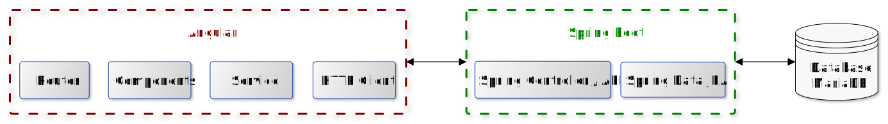
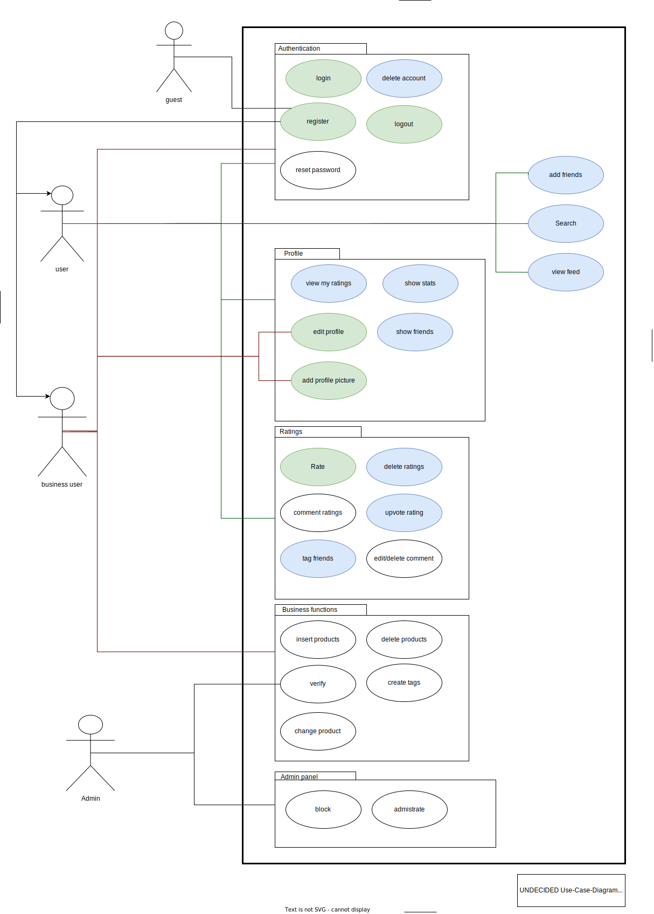
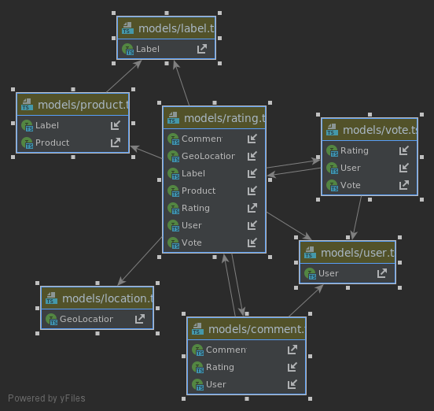
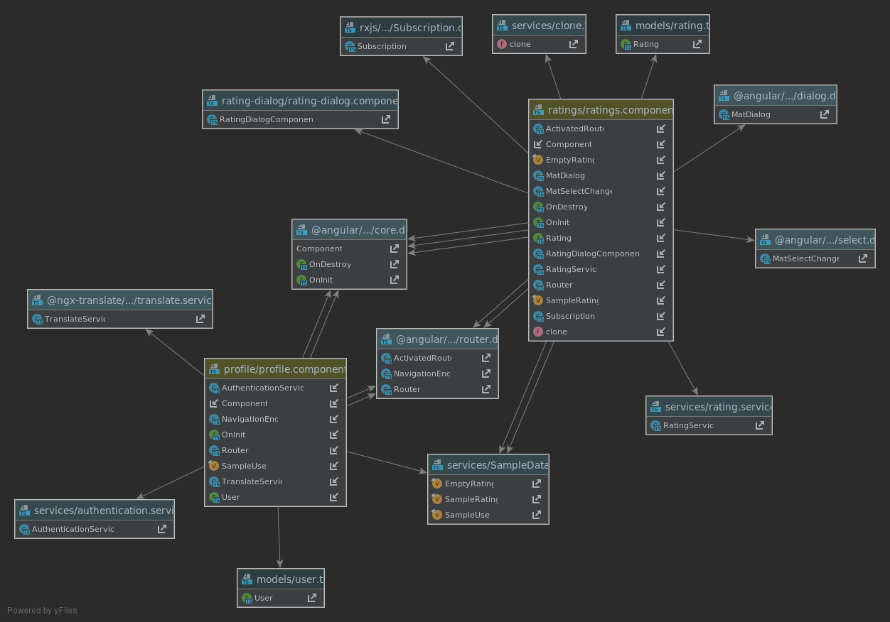
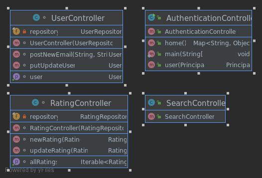
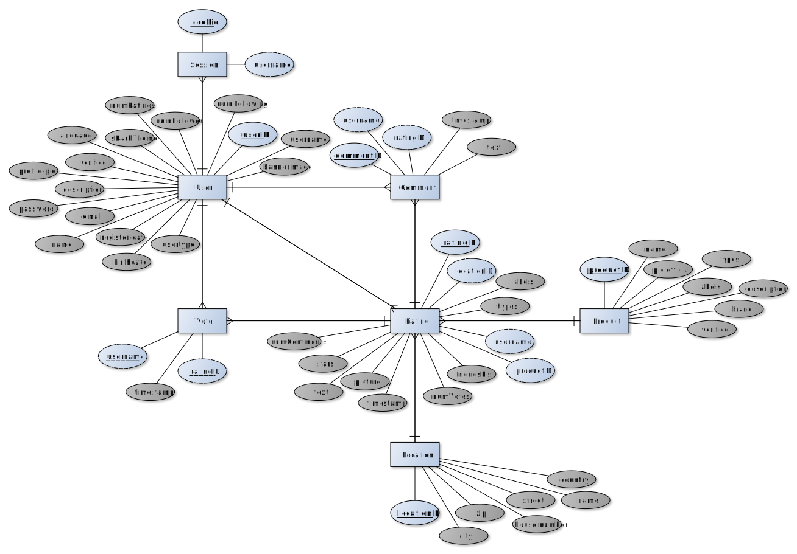

# Software Architecture Document

# Table of Contents
- [Introduction](#1-introduction)
    - [Purpose](#11-purpose)
    - [Scope](#12-scope)
    - [Definitions, Acronyms and Abbreviations](#13-definitions-acronyms-and-abbreviations)
    - [References](#14-references)
    - [Overview](#15-overview)
- [Architectural Representation](#2-architectural-representation)
- [Architectural Goals and Constraints](#3-architectural-goals-and-constraints)
- [Use-Case View](#4-use-case-view)
- [Logical View](#5-logical-view)
    - [Overview](#51-overview)
    - [Architecturally Significant Design Packages](#52-architecturally-significant-design-packages)
- [Process View](#6-process-view)
- [Deployment View](#7-deployment-view)
- [Implementation View](#8-implementation-view)
- [Data View](#9-data-view)
- [Size and Performance](#10-size-and-performance)
- [Quality](#11-quality)

# 1. Introduction

## 1.1 Purpose
This document provides a comprehensive architectural overview
of the system, using a number of different architectural views
to depict different aspects of the system. It is intended to capture
and convey the significant architectural decisions which have been made
on the system.

## 1.2 Scope
This document describes the technical architecture of the UNDECIDED project, including the structure of classes, modules and dependencies.

## 1.3 Definitions, Acronyms and Abbreviations

| Abbrevation | Description                            |
| ----------- | -------------------------------------- |
| API         | Application programming interface      |
| MVC         | Model View Controller                  |
| REST        | Representational state transfer        |
| MVVM        | Model View ViewModel                   |
| UC          | Use Case                               |
| n/a         | not applicable                         |

## 1.4 References

| Title                                                              | Date       | Publishing organization   |
| -------------------------------------------------------------------|:----------:| ------------------------- |

## 1.5 Overview
This document contains the Architectural Representation, Goals and Constraints as well
as the Logical, Deployment, Implementation and Data Views.

# 2. Architectural Representation
We are trying to implement according to the MVC pattern:

In our project it looks like the following picture:

# 3. Architectural Goals and Constraints
As already mentioned our project follows the MVC architecure. By following the guidelines of this architecture we are able to generate clean code.

## Frontend
The frontend is written in Typescript and we are using the Angular framework. By the seperation of components from 
rest of the code angular allows us to stick to the MVVM pattern.

- Model: domain specific classes modeled after backend classes
- View: components
- ViewModel: functionalities of components

## Backend
The backend is written in Java and as a MVC tool we are using Spring Boot.
For accounting we are using Spring Security. The backend offers multiple REST
APIs which are accesed by our frontend.

- Model domain specific classes
- View: no view available
- Controller: REST-Controller

# 4. Use-Case View
Our overall UC diagram:

# 5. Logical View

## 5.1 Overview
The following image shows a UML diagram of our project whose elements are categorized by model, view and controller.

### Model
#### Frontend

#### Backend

### Controller
#### Frontend
Because it would be too unclear we only show some of our frontend controller:

#### Backend

### View
#### Frontend
Because in Angular controller and view is not strictly seperated it's the same diagram as in the controller section.

## 5.2 Architecturally Significant Design Packages

# 6. Process View
n/a

# 7. Deployment View
(n/a)

# 8. Implementation View
(n/a)

# 9. Data View
Our database structure in model classes:

# 10. Size and Performance
n/a

# 11. Quality/Metrics
n/a
