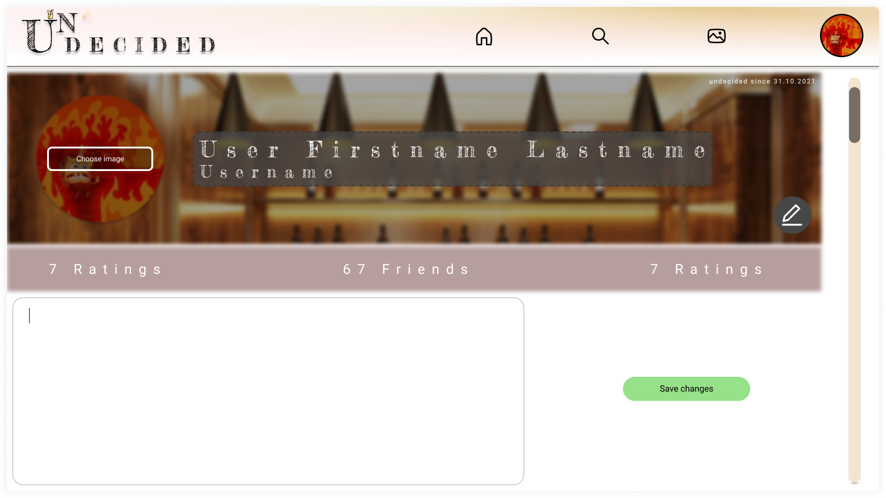

# 1 Edit Profile
[Edit Profile](../SRS.md#316-edit-profile)

## 1.1 Brief Description
A user is able to make changes to his profile attributes, like his name or email etc.
# 2 Flow of Events
## 2.1 Basic Flow

- User clicks on "edit profile" button
- User changes either 
    - his email
    - his description
    - his name
    - his new password
    - his profile picture
    - nothing
- User clicks on "save changes" button or "cancel" button 

### 2.1.1 Activity Diagram


### 2.1.2 Mock-up


### 2.1.3 Narrative
```gherkin
Feature: Edit Profile
as a User
I want to be able to change my profile attributes.

	Background:
		Given following attributes:
			| attribute       | required |
			| profile picture | false    |
			| banner picture  | true     |
			| description     | false    |
			| name            | true     |
		Given user is logged in
		And user is on their profile page
		And the button for "edit profile" is clicked


	Scenario: successfully changed profile attributes
		When user changes any attributes
		And user saves changes
		Then changes are sent to server
		And DB is updated
		And back to profile page
		Then wait 1 second
		And request user details from server
		And update the user details in the client

	Scenario: no profile attribute changes
		When user presses cancel button
		Then discard any entered changes
		And back to profile page

	Scenario: invalid profile attribute changes
		When user leaves a required attribute empty
		Then save changes button is disabled
		And the corresponding input field is highlighted
```

## 2.2 Alternative Flows
### No profile attribute changes

- User clicks on "edit profile" button
- User changes nothing and clicks on "cancel" button


# 3 Special Requirements
(n/a)

# 4 Preconditions
## 4.1 Login
The user has to be logged in to the system.

## 4.2 Profile Page
The user has to be on his profile page.

# 5 Postconditions
(n/a)

# 6 Extension Points
(n/a)
