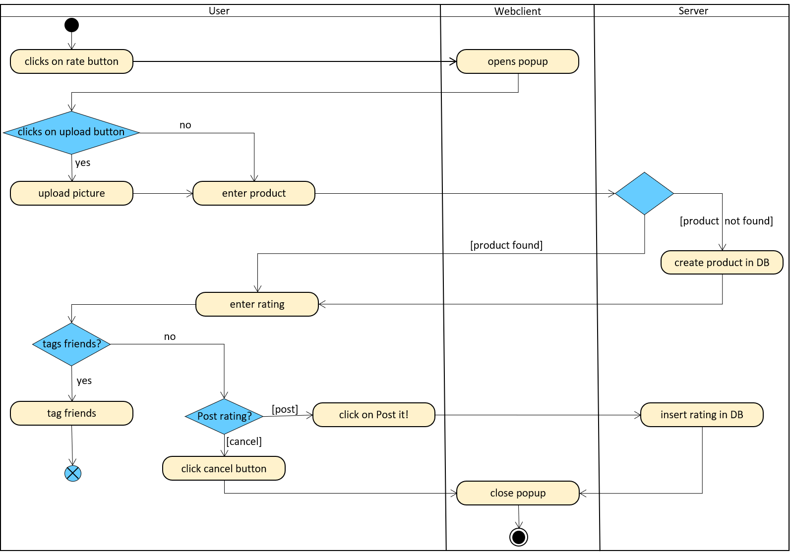
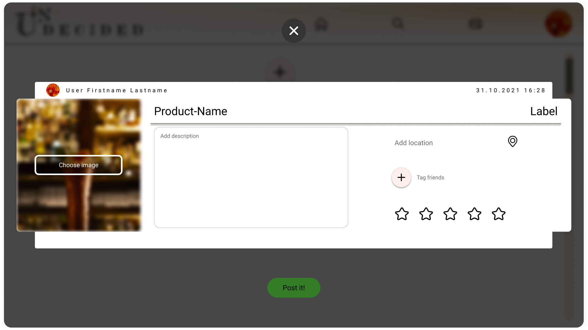

# 1 Rate
[Rate](../SRS.md#3110-rate)

## 1.1 Brief Description
A user is able to rate a product by writing a review and uploading an optional picture of the product.

# 2 Flow of Events
## 2.1 Basic Flow
- User clicks on "rate" button
- User can upload an optional picture
- User chooses product they want to rate
- User enters their rating
- User is able to tag a friend if he wants to

### 2.1.1 Activity Diagram


### 2.1.2 Mock-up


### 2.1.3 Narrative
```gherkin
Feature: Rate
  as a User
  I want to rate a product and upload a picture

  Background:
    Given following rating attributes:
      | attribute     | required |
      | image         | false    |
      | product name  | true     |
      | product brand | false    |
      | product type  | true     |
      | product tags  | false    |
      | description   | false    |
      | stars         | true     |
      | friends       | false    |
    Given is logged in
    And new rating is clicked

  Scenario: post rating
    When user enters attributes
    And all required attributes are set
    Then post rating

  Scenario: discard rating
    When user clicks
    Then enter rating
    Then tag friends
    Then post rating

  Scenario: temporarily save rating
    When user clicks on dialog's backdrop
    Then save the created rating
    But do not post it
    And close the popup

  Scenario: post rating which you previously worked on
    When saved rating is found
    Then load the popup with these changes to the input fields

  Scenario: invalid rating attribute changes
    When user leaves a required attribute empty
    Then post button is disabled
    And the corresponding input field is highlighted
```

## 2.2 Alternative Flows
### Post rating

- User clicks on rate button
- User enters all required attributes
- User clicks on 'post rating'

### Discard rating

- User clicks on rate button
- User enters the rating
- User tags friends
- User clicks on cancel button


# 3 Special Requirements
(n/a)

# 4 Preconditions
## 4.1 Login
The user has to be logged in to the system.

# 5 Postconditions
(n/a)

# 6 Extension Points
(n/a)
