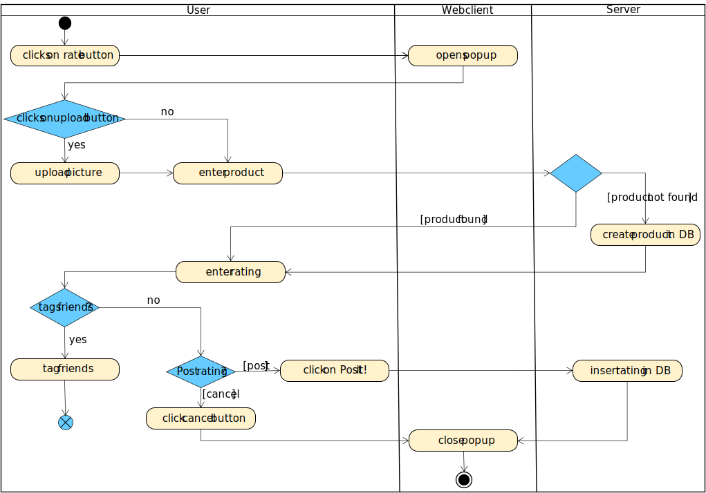

# 1 Use-Case Name
[Register](../SRS.md#316-edit-profile)

## 1.1 Brief Description
In the authentification process a guest has the possibility to register to get access to the website's functionalities.
In other words: A guest becomes a (business) user by creating an account.
# 2 Flow of Events
## 2.1 Basic Flow

- User clicks on "register" button
- User enters 
    - name
    - username
    - email
    - birthdate
    - password
    - repeat password
- User changes either
    - name
    - username
    - email
    - birthdate
    - password
    - password
- User clicks on "Sign Up" button or "cancel" button 

### 2.1.1 Activity Diagram

### 2.1.2 Mock-up
(n/a)

### 2.1.3 Narrative
(n/a)
## 2.2 Alternative Flows
(n/a)

# 3 Special Requirements
(n/a)

# 4 Preconditions
(n/a)

## 4.2 Profile Page
(n/a)

# 5 Postconditions
(n/a)

# 6 Extension Points
(n/a)
